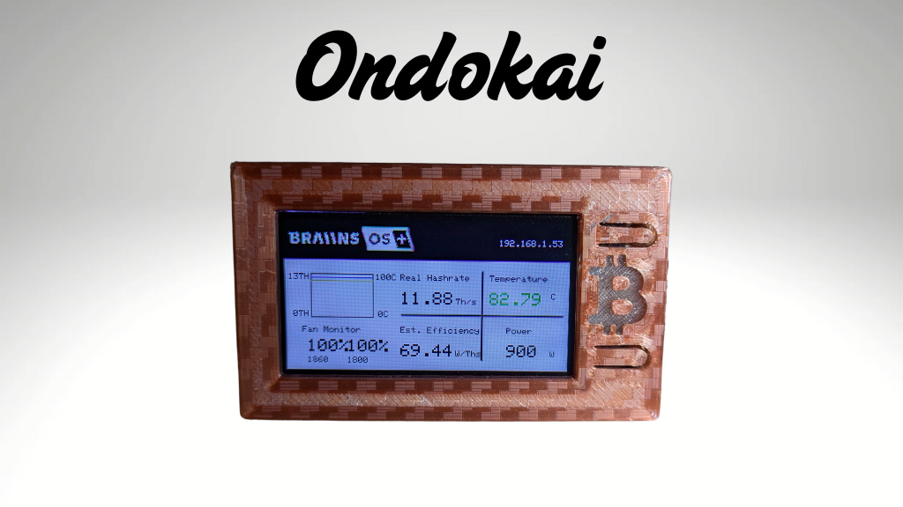
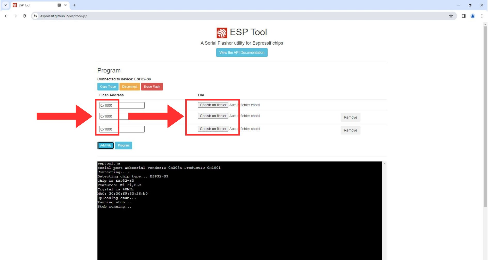
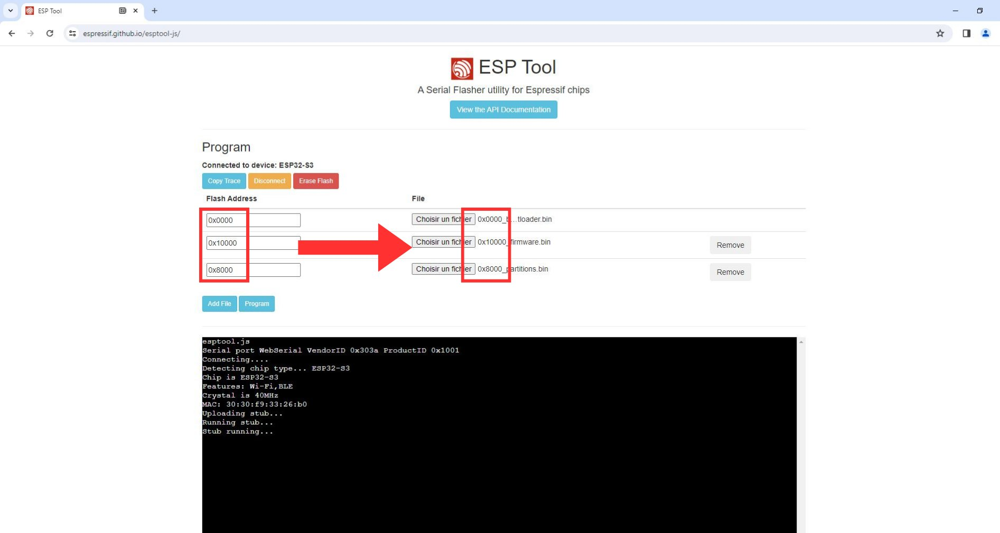
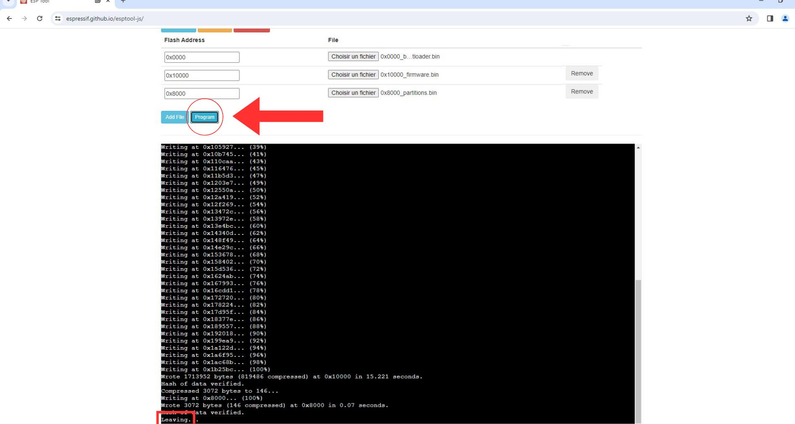

# Ondokai


**Ondokai** est un projet basé sur l'ESP32 qui permet de surveiller et (dans un futur proche) de contrôler un miner. Ce projet utilise un écran TFT pour afficher en temps réel des informations essentielles provenant du miner, telles que :

- Le **hashrate** (puissance de calcul en temps réel),
- La **température** moyenne des puces du miner,
- L'**efficacité** énergétique (W/Th),
- La **consommation d'énergie** (en watts),
- La **vitesse des ventilateurs** (en pourcentage et en RPM).



## Fonctionnalités actuelles

1. **Surveillance du miner :**
   - Extraction de données du miner via des commandes JSON envoyées sur le port 4028.
   - Affichage des informations collectées sur un écran TFT.
   - Suivi du hashrate et de la température sous forme de graphique.

2. **WiFi intégré :**
   - Connexion au réseau local via l'ESP32.
   - Configuration WiFi simplifiée grâce à [WiFiManager](https://github.com/tzapu/WiFiManager).

3. **Graphiques en temps réel :**
   - Visualisation de l'évolution du hashrate et de la température sur un graphique.

4. **Utilisation intuitive :**
   - Bouton pour actualiser les données et redessiner l'écran.
   - Bouton pour réinitialiser les paramètres WiFi.

5. **Ping du miner :**
   - Vérification de l'accessibilité du miner via un ping.

## Fonctionnalités prévues

Dans les futures versions, Ondokai permettra :
- **Le contrôle du miner :**
  - Ajuster la puissance du miner directement depuis l'ESP32.
  - Optimiser la consommation énergétique selon les besoins.

- **Ajout d'alertes :**
  - Notifications en cas de températures élevées ou de perte de connectivité.

- **Interface web intégrée :**
  - Contrôle et visualisation à distance depuis un navigateur.

## Dépendances

Ce projet utilise les bibliothèques suivantes :
- **[ArduinoJson](https://arduinojson.org/)** pour l'analyse des réponses JSON.
- **[WiFiManager](https://github.com/tzapu/WiFiManager)** pour la gestion WiFi.
- **[TFT_eSPI](https://github.com/Bodmer/TFT_eSPI)** pour le contrôle de l'écran.
- **[NTPClient](https://github.com/arduino-libraries/NTPClient)** pour la synchronisation de l'heure.
- **[ESP32Ping](https://github.com/marian-craciunescu/ESP32Ping)** pour vérifier la connectivité réseau.

## Installation

1. **Prérequis :**
   - Un ESP32 LILYGO T-Display S3 compatible.

2. **Cloner le dépôt :**
   ```bash
   git clone https://github.com/OxScuba/Ondokai_ESP32
   cd ondokai
   ```

3. **Configurer les bibliothèques :**
   - Installez les bibliothèques listées dans **Dépendances** via le gestionnaire de bibliothèques Arduino.

4. **Configurer le projet :**
   - Configurez le fichier `TFT_eSPI/User_Setup.h` pour votre écran.
   - Chargez le projet dans l'IDE Arduino et téléversez-le sur l'ESP32.

5. **Configurer le WiFi :**
   - Lors du premier démarrage, connectez-vous au réseau "Ondokai" avec le mot de passe "TicTocNextBlock".
   - Suivez les instructions pour configurer la connexion WiFi.

### Flasher le Firmware pour Ondokai

Créez votre propre Ondokai en utilisant l’outil de flashage de firmware en ligne **ESPtool** et l’un des fichiers binaires disponibles dans le dossier `bin`. Si vous préférez, vous pouvez également compiler l’ensemble du projet en utilisant Arduino, PlatformIO ou Expressif IDF.

#### Étapes à suivre :
1. **Obtenez une carte TTGO T-display S3**.
2. **Téléchargez ce dépôt**.
3. **Rendez-vous sur ESPtool en ligne** : [https://espressif.github.io/esptool-js/](https://espressif.github.io/esptool-js/).
4. **Chargez le firmware** en sélectionnant le fichier binaire correspondant à votre carte dans l’un des sous-dossiers du dossier `bin`.
5. **Branchez votre carte ESP32**, et choisissez chaque fichier `.bin` requis dans le sous-dossier :
   - Ajouter les fichiers dans l'ordre  ci-dessous, en renseignant bien les adresses correspondantes

- 0x0000 -> 0x0000_bootloader.bin
- 0x10000-> 0x10000_firmware.bin
- 0x8000 -> 0x8000_partitions.bin





Appuyez sur PROGRAM 

Une fois cette procédure terminée, l'esp32 devrait démarrer avec le firmware Ondokai correctement installé.

## Utilisation

1. **Surveillance :**
   - L'écran affichera les données du miner en temps réel.
   - Appuyez sur le bouton **actualiser** pour mettre à jour manuellement les données.

2. **Réinitialisation :**
   - Appuyez sur le bouton de **réinitialisation** pour supprimer les paramètres WiFi et redémarrer.


## Contribuer

Les contributions sont les bienvenues ! Si vous souhaitez améliorer Ondokai, ouvrez une **issue** ou soumettez une **pull request**.

1. Forkez le projet.
2. Créez une branche pour votre modification : `git checkout -b feature-nouvelle-fonctionnalite`.
3. Faites vos modifications et testez-les.
4. Soumettez votre pull request !

